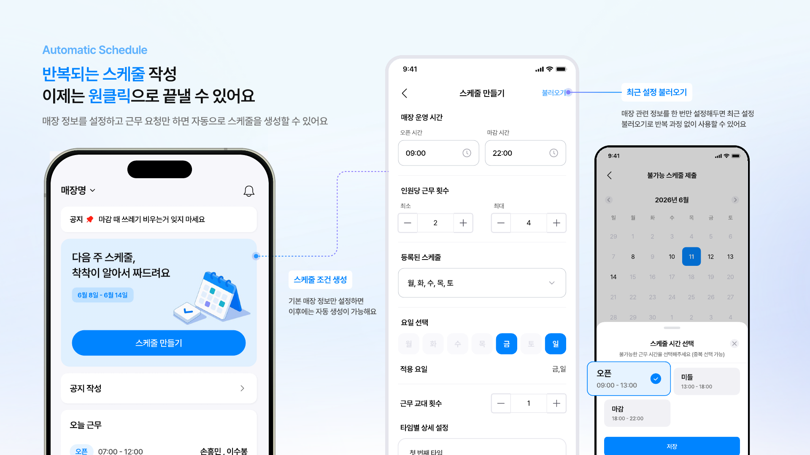
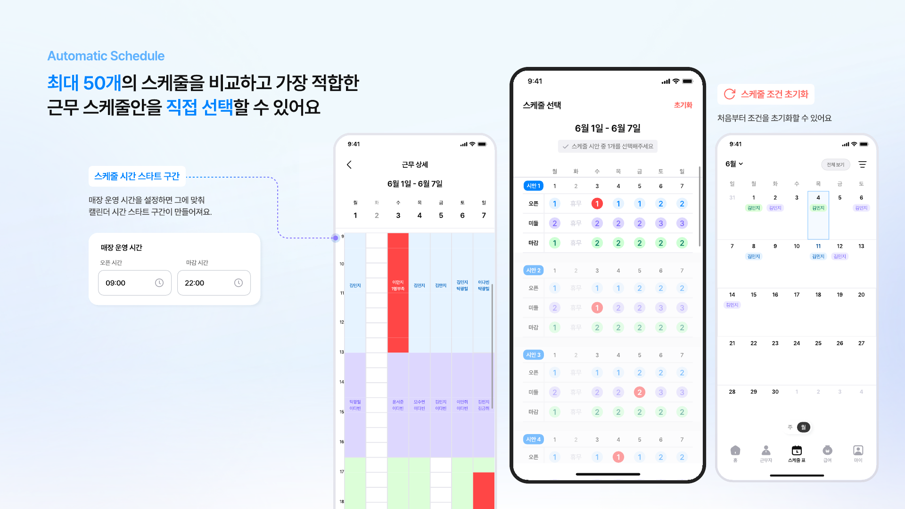
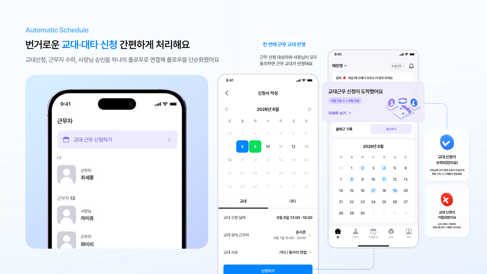
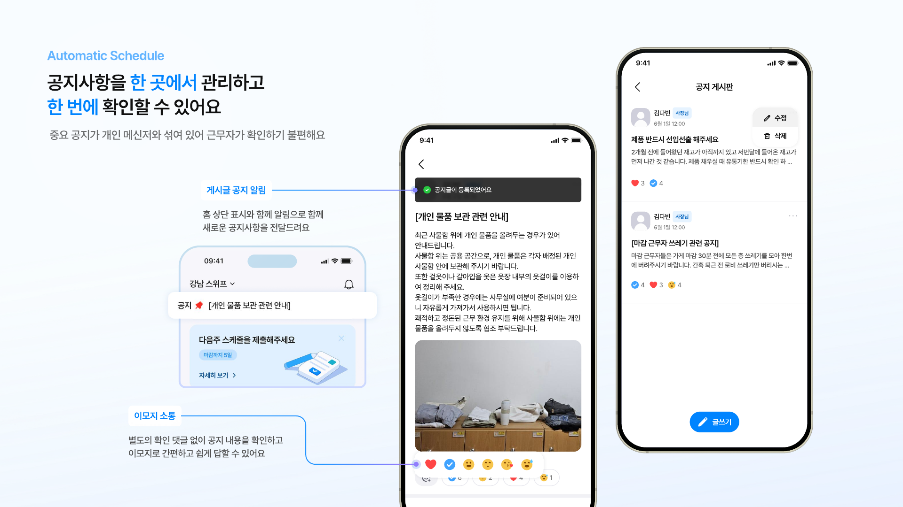
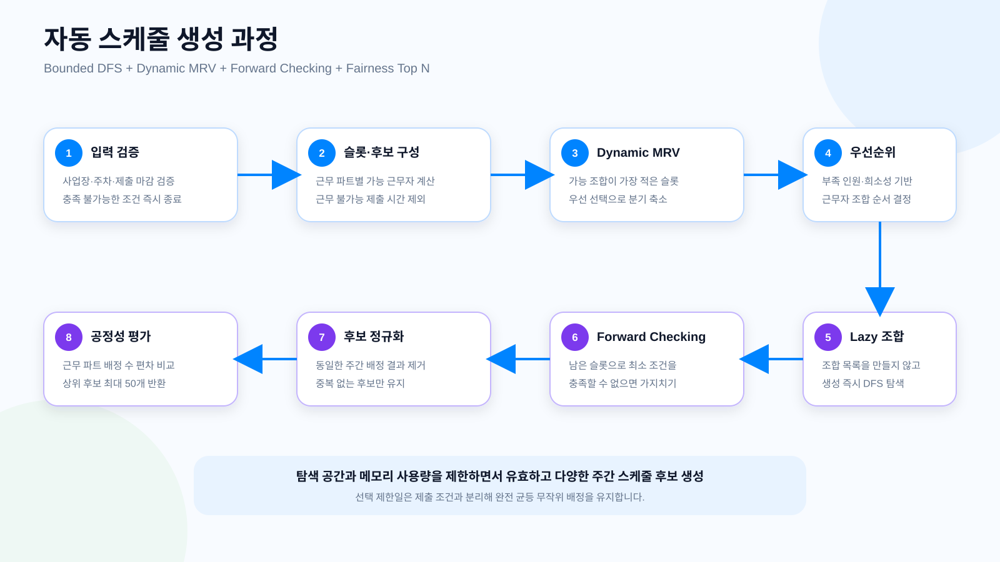
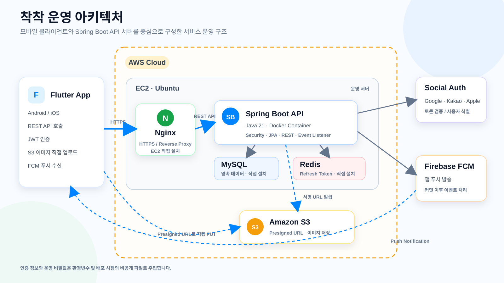

<div align="center">
  

  <h1>착착 Backend</h1>

  <p>
    사장님과 근무자의 반복적인 일정 조율을 줄여주는<br />
    <strong>자동 근무표 생성 및 근무 관리 서비스</strong>입니다.
  </p>

  <p>
    <a href="https://apps.apple.com/kr/app/id6793128191">
      
    </a>
    <a href="https://play.google.com/store/apps/details?id=com.chackchack.service">
      
    </a>
  </p>

  <p>
    
    
    
    
    
  </p>
</div>

---

## 서비스 소개

유동 근무 사업장에서는 사장님이 근무자의 가능 시간을 취합하고, 인원과 시간 조건을 맞춰 매주 근무표를 다시 작성해야 합니다. 확정 후에도 공지 전달과 교대·대타 요청이 메신저에 흩어져 반복적인 확인과 조율이 발생합니다.

착착은 이 과정을 하나로 연결합니다.

- 사장님은 사업장 운영 조건과 필요한 근무 파트를 설정합니다.
- 근무자는 마감 기한 안에 근무 불가능한 시간을 제출합니다.
- 착착은 조건을 만족하는 주간 스케줄 후보를 자동 생성합니다.
- 사장님은 후보를 비교해 확정하고 필요할 때 직접 편집할 수 있습니다.
- 근무자는 확정된 일정에서 교대·대타를 요청하고 처리 상태를 확인합니다.
- 공지사항과 앱 푸시로 사업장 구성원에게 변경 내용을 전달합니다.

## 핵심 기능

### 자동 스케줄 생성

사업장 운영 시간, 필요 인원, 근무 파트와 근무자 제출 조건을 반영해 다음 주 스케줄을 생성합니다.

<p align="center">
  
</p>

### 스케줄 후보 비교 및 확정

최대 50개의 후보를 비교하고 사업장에 적합한 한 주 스케줄을 선택해 확정합니다.

<p align="center">
  
</p>

### 교대·대타 요청

근무자 요청, 상대 근무자 응답, 사장님 최종 승인을 하나의 흐름으로 관리하고 승인 결과를 확정 스케줄에 반영합니다.

<p align="center">
  
</p>

### 공지 및 알림

사업장별 공지, 댓글, 공감과 이미지 첨부를 지원하고 주요 변경 사항은 FCM 앱 푸시로 전달합니다.

<p align="center">
  
</p>

## 자동 스케줄 생성

자동 스케줄 생성기는 교체 가능한 인터페이스 뒤에 구현되어 있습니다. 현재 구현체는 단순 완전탐색에서 발생하는 조합 폭증을 줄이고, 제한된 서버 자원에서도 유효하고 다양한 후보를 제공하도록 최적화했습니다.

- `Bounded DFS`로 탐색 후보와 메모리 사용량 제한
- 동적 MRV로 가능한 조합이 적은 슬롯부터 선택
- Forward Checking으로 남은 조건을 만족할 수 없는 경로 조기 중단
- 조합 목록을 미리 만들지 않는 Lazy 조합 생성
- 근무 불가능 제출 시간 제외 및 선택 제한일 무작위 배정
- 동일한 주간 배정 결과 중복 제거
- 근무 파트 배정 수를 기준으로 공정성 평가
- 탐색 중 상위 후보를 유지하고 최종 최대 50개 반환

<p align="center">
  
</p>

## 기술 스택

| 구분 | 기술 |
| --- | --- |
| Language | Java 21 |
| Framework | Spring Boot 3.5.14, Spring Web MVC, Spring Security |
| Persistence | Spring Data JPA, MySQL 8.4 |
| Cache / Token | Redis 7.2 |
| Authentication | JWT, Google·Kakao·Apple Social Login |
| Storage / Messaging | AWS S3 Presigned URL, Firebase Cloud Messaging |
| Infrastructure | AWS EC2, Docker, Nginx |
| API Documentation | SpringDoc OpenAPI, Swagger UI |
| Test | JUnit 5, MockMvc, Mockito, AssertJ, Testcontainers |
| Monitoring | Spring Boot Actuator, Micrometer Prometheus |

## 운영 아키텍처

Flutter 앱은 HTTPS로 Nginx를 거쳐 Spring Boot REST API를 호출합니다. 운영 EC2에는 Nginx, MySQL, Redis를 직접 설치하고 Spring Boot 애플리케이션은 Docker 컨테이너로 실행합니다.

이미지는 백엔드가 발급한 Presigned URL을 이용해 앱에서 S3로 직접 업로드합니다. 주요 알림은 데이터베이스 트랜잭션 커밋 이후 이벤트 리스너가 FCM으로 발송하며, 실패 결과는 발송 이력과 로그에 기록합니다.

<p align="center">
  
</p>

### 주요 설계 원칙

- 기능 도메인별 레이어드 아키텍처와 DTO 기반 API 경계
- OWNER·WORKER 역할과 사업장 소유·소속 관계를 결합한 비즈니스 권한 검증
- 기기별 Refresh Token을 Redis에 저장하고 로그아웃·회원 탈퇴 시 무효화
- 목록 조회 시 Fetch Join과 `IN` 조회를 사용해 N+1 쿼리 방지
- 조회 패턴에 맞춘 MySQL 복합 인덱스와 명시적 DDL 관리
- 커밋 이후 이벤트 처리로 핵심 트랜잭션과 외부 FCM 발송 분리
- 환경변수와 배포 시점의 비공개 파일을 이용한 운영 비밀값 주입

## 테스트

비즈니스 규칙 단위 테스트, MockMvc 기반 API 테스트, Testcontainers 기반 MySQL·Redis 통합 테스트를 분리해 운영 환경과의 차이를 줄였습니다.

MVP 발표 시점 기준으로 총 324개 테스트를 실행해 실패 0건, 성공률 100%를 확인했습니다. 현재도 전체 회귀 테스트는 아래 명령으로 실행합니다.

```powershell
.\gradlew.bat clean test
```

```bash
./gradlew clean test
```

## 프로젝트 구조

기능 도메인별 패키지 안에서 `controller`, `service`, `repository`, `domain`, `dto`의 책임을 분리합니다.

```text
src/main/java/com/autoschedule
├── auth
├── crew
├── global
├── member
├── notice
├── notification
├── schedule
├── schedulecondition
├── terms
├── workchange
├── workerselect
└── workplace
```

## API 문서

- 전체 API 명세: [API_SPEC.md](API_SPEC.md)
- 로컬 Swagger UI: `http://localhost:{APP_PORT}/swagger-ui/index.html`
- 모든 서비스 API는 `/api/*` 경로를 사용합니다.

<details>
<summary><strong>로컬 실행</strong></summary>

### 준비 사항

- Docker Desktop 또는 Docker Engine
- 프로젝트 환경변수가 정의된 `.env` 파일

환경변수와 외부 서비스 인증 파일은 저장소에 커밋하지 않습니다.

### Docker Compose 실행

```powershell
docker compose up --build
```

Spring Boot, MySQL, Redis가 함께 실행되며 MySQL 최초 실행 시 `DDL_V9.sql`과 로컬 seed 데이터가 적용됩니다.

```text
Health Check: http://localhost:{APP_PORT}/actuator/health
Swagger UI:  http://localhost:{APP_PORT}/swagger-ui/index.html
```

자세한 설정은 [LOCAL_DOCKER.md](LOCAL_DOCKER.md)를 참고합니다.

</details>

<details>
<summary><strong>브랜치 및 커밋 컨벤션</strong></summary>

Simple Git Flow를 사용합니다.

| 브랜치 | 용도 |
| --- | --- |
| `main` | 운영 배포 기준 브랜치 |
| `develop` | 개발 통합 브랜치 |
| `feature/*` | 기능 개발 브랜치 |

커밋 메시지는 `feat:`, `fix:`, `refactor:`, `test:`, `docs:`, `chore:`, `perf:` 등의 타입을 사용하고 본문은 한글로 작성합니다.

</details>

## 팀

| 역할 | 인원 |
| --- | --- |
| Backend | 안준호, 정진섭 |
| Flutter | 이윤정 |
| Design | 김다빈, 김태완, 이세령 |

## 보안 원칙

- 비밀 키, 토큰, 인증서 및 실제 환경변수 파일을 커밋하지 않습니다.
- 운영 설정은 환경변수와 배포 시점의 비공개 설정 파일로 주입합니다.
- 데이터베이스 스키마의 최종 기준은 `src/main/resources/db/DDL_V9.sql`입니다.
